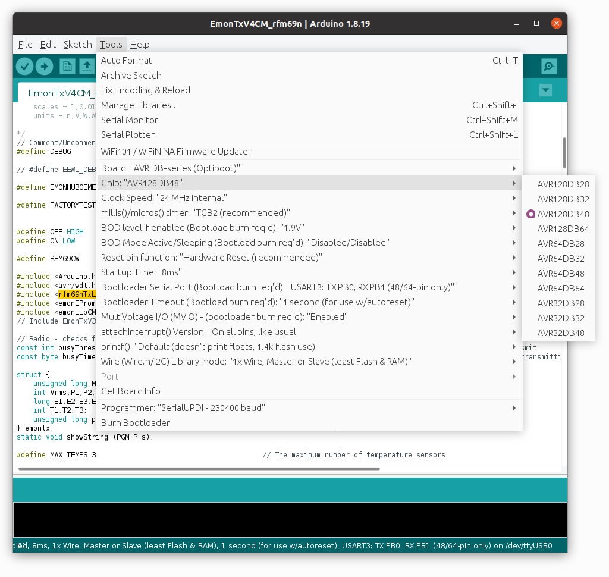

# Firmware

The emonTx v4 firmware can be edited and compiled using the [Arduino IDE](https://www.arduino.cc/) with [DxCore installed](https://github.com/SpenceKonde/DxCore).
DxCore is an Arduino core for the AVR-DB microcontroller range, developed by SpenceKonde.

## Available Firmware

**[EmonTxV4:](EmonTxV4)** Single phase, 6 CT channel, continuous sampling, cumulative energy persisted to EEPROM, LowPowerLabs RFM69 radio format (JeeLib also supported via #define), 3x DS18B20 temperature sensors supported by default, serial configuration and data output.

The latest version of the emonTx4 firmware is: **v1.5.4**

- Source code: [https://github.com/openenergymonitor/emontx4/tree/main/firmware/EmonTxV4](https://github.com/openenergymonitor/emontx4/tree/main/firmware/EmonTxV4)
- Pre-compiled hex: [https://github.com/openenergymonitor/emontx4/tree/main/firmware/EmonTxV4/compiled](https://github.com/openenergymonitor/emontx4/tree/main/firmware/EmonTxV4/compiled)

## Updating firmware using an emonBase

The easiest way of updating the emonTx4 firmware is to connect it to an emonBase with a USB cable and then use the firmware upload tool available at Setup > Admin > Update > Firmware.

- Double check the serial port, this is likely to be 'ttyUSB0' when plugged in via USB. Select 'emonTx4' from hardware.

- The standard radio format is 'LowPowerLabs', if you wish to use the emonTx4 with an existing system running JeeLib classic radio format you can select the JeeLib classic radio format here.

## Uploading pre-compiled firmware

Alternatively to upload the same pre-compiled firmware via command line using avrdude, the command to do this is:

    avrdude -Cavrdude.conf -v -pavr128db48 -carduino -D -P/dev/ttyUSB0 -b115200 -Uflash:w:EmonTxV4_LPL.hex:i 
    
You will need avrdude installed (tested on version 6.3-2017) and the custom DxCore avrdude.conf. This can be downloaded here: [DxCore avrdude.conf](https://raw.githubusercontent.com/openenergymonitor/emontx4/main/firmware/avrdude.conf).

## How to compile and upload firmware:

If you don’t already have the Arduino IDE it can be downloaded from here: 
[https://www.arduino.cc/en/software](https://www.arduino.cc/en/software)

Once you have the IDE installed, you then need to install [Spence Konde’s DxCore](https://github.com/SpenceKonde/DxCore). This can be done by first pasting the following board manager URL in Arduino IDE > File > Preferences:

    http://drazzy.com/package_drazzy.com_index.json

Then navigating to: *Tools > Boards > Boards Manager*, Select “DxCore by Spence Konde” and click Install. 

For more information on DxCore installation see: [https://github.com/SpenceKonde/DxCore/blob/master/Installation.md](https://github.com/SpenceKonde/DxCore/blob/master/Installation.md).

**Libraries**

Next install the libraries used by the main firmware, download and place these in your Arduino libraries folder.

1\. Download EmonLibCM library (avrdb branch) 
[https://github.com/openenergymonitor/EmonLibCM/tree/avrdb](https://github.com/openenergymonitor/EmonLibCM/tree/avrdb)

2\. Download emonEProm library (avrdb branch) 
[https://github.com/openenergymonitor/emonEProm/tree/avrdb](https://github.com/openenergymonitor/emonEProm/tree/avrdb)

3\. Download RFM69_LPL library (avrdb branch) 
[https://github.com/openenergymonitor/RFM69_LPL/tree/avrdb](https://github.com/openenergymonitor/RFM69_LPL/tree/avrdb)

4\. Download RFM69_JeeLib library (avrdb branch) 
[https://github.com/openenergymonitor/RFM69_JeeLib/tree/avrdb](https://github.com/openenergymonitor/RFM69_JeeLib/tree/avrdb)

5\. Download DxCore SpenceKonde OneWire library: 
[https://github.com/SpenceKonde/OneWire](https://github.com/SpenceKonde/OneWire)

**Compilation settings:**

With DxCore and the libraries installed the firmware should then compile. 

Under Tools, select the following configuration options:

- Select Chip: AVR128DB48
- Clock Speed: 24 MHz Crystal
- Bootloader serial port: UART3: TXPB0, RXPB1

