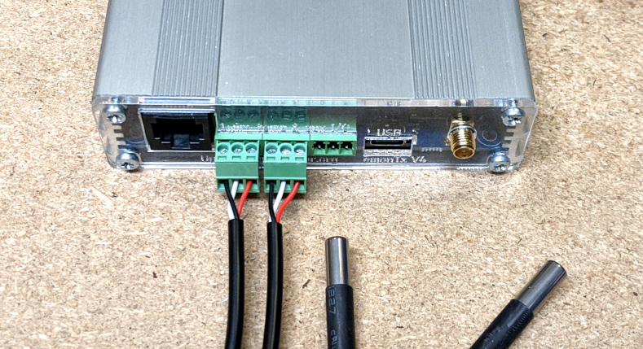

# Other sensors

## Temperature sensing

The emonTx4 supports temperature sensing via [DS18B20 temperature sensors](../electricity-monitoring/temperature/DS18B20-temperature-sensing.md). These are small temperature sensors with a 12-bit ADC and a digital output all in the sensor itself. Communication is over a one-wire bus and requires little in the way of additional components. The sensors have a quoted accuracy of ±0.5°C in the range -10°C to +85°C.

It is possible to connect DS18B20 temperature sensors to the emonTx4 either via the 3 pluggable terminal blocks or via the RJ45 connector (just to the left of the terminal blocks in the picture below).

Pluggable terminal block connections are: GND (black), DATA (white), 3.3V (red), left to right, repeated for each of the three blocks:



The function of the emonTx4 terminal blocks can be changed with small solder-jumpers just above the terminals on the emonTx4 PCB. The default configuration is 3x temperature sensor inputs, one on each terminal block. Notice the bridged solder jumpers circled in red and labeled 'TMP' in the picture below: 


The DS18B20 input is connected to digital PIN_PB4 on the AVR128DB48 microcontroller.

```{tip}
It's possible to change the function of the 'Data' pin on each of the terminal blocks. 

- Terminal 1 (left) can be either temperature sensing or pulse input. 
- Terminal 2 (middle) can be either temperature sensing or digital input/output PA7. 
- Terminal 3 (right) can be either temperature sensing or analog input AIN19 (CT12).

Move the solder link as required to configure these for your application. Additional firmware changes are required to make use of the digital input/output PA7 and the analog input AIN19 (CT12).
```

The emonTx4 firmware supports up to 3x temperature sensors by default. This can be extended to support more temperature sensors with firmware modification. *However it is worth noting that due to the way that the one wire protocol works, specifically it's requirement for precise timing requiring brief periods of disabling other interrupts on the microcontroller, that there is a minor negative impact on energy monitoring performance as you add more temperature sensors. This can manifest as a ±1-4W error on some CT channels. This effect can be mitigated to some extent by reducing the electricity monitoring sample rate.*

## Pulse counting


## Analog input

It's possible to link analog input AIN19 (CT12) to right-most terminal block as shown below:


