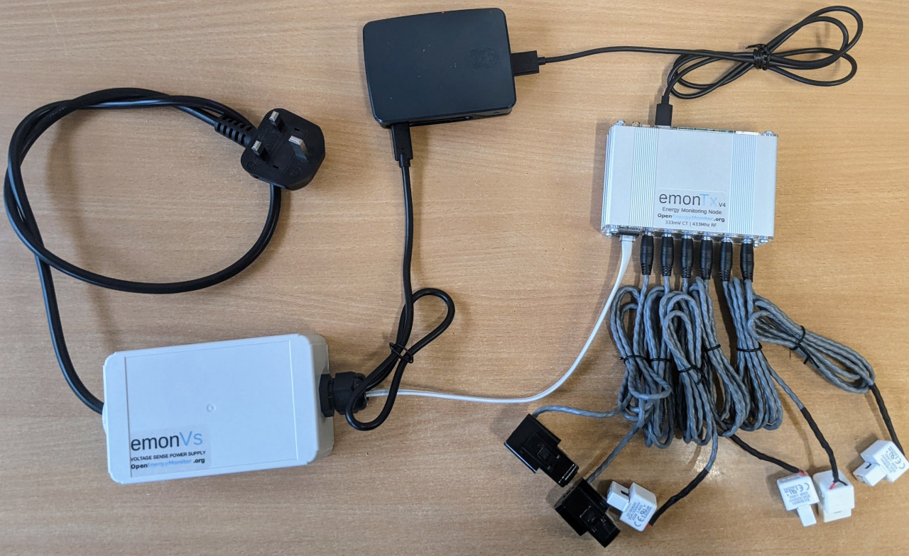

# EmonTx4, emonVs & emonBase Install Guide

The following guide covers installation of the EmonTx4 6x input energy monitor in combination with an emonBase (RaspberryPi base-station). Using an EmonTx with an emonBase provides full local emoncms data logging and visualisation capabilities as well as the option to expand data input from other devices.

The following EmonTx4, emonVs and emonBase bundle will soon be available in the OpenEnergyMonitor shop with all the parts needed to build this configuration:

**Included in the bundle**

- EmonTx v4: 6 input electricity monitor
- EmonVs: Precision voltage sensor and power supply
- EmonBase: RaspberryPi base-station
- Up to 6 CT sensors
- RJ11 voltage sensor cable
- USB-C data cable for wired connection between the EmonTx4 and emonBase

**Steps to install**

1. Plug CT sensors into emonTx via 3.5mm jack plugs

2. Clip CT sensors around Live OR Neutral cable of the AC circuit to be measured (not both)

3. Plug emonTx into Raspberry Pi base-station USB-A port using USB-C to USB-A cable

4. Plug emonVS RJ11 cable into emonTx 

5. Plug emonVS USB-C cable into  Raspberry Pi base-station power input connector

6. Plug emonVS into mains power via a domestic wall socket

7. (optionally) connect Raspberry Pi base-station to Ethernet 

8. Switch on mains socket and verify that the green LED on the emonTx and the red LED on the Raspberry Pi illuminates

9. After a few moments the Raspberry Pi will create a WiFi Access Point called ‘emonpi’, connect to this using password ‘emonpi2016’

10. Browse the IP address http://192.168.42.1 and follow the setup wizard to connect the device to your local WiFi network

9. Once connected to your local WiFi network the base-station can be accessed via http://emonpi or http://emonpi.local

**Instructions for safe use:**

    • Clip-on CT sensors are non-invasive and should not have direct contact with the AC mains. As a precaution, we recommend ensuring all cables are fully isolated prior to installing. If in doubt seek professional assistance.
    • Do not expose to water or moisture 
    • Do not expose to temperate above rated operating limits 
    • Indoor use only
    • Do not connect unapproved accessories 
    • Please contact us if you have any questions 

## Extended version

A good place to start is to assess the location where you wish to install the EmonTx4, identify the circuits that you wish to monitor using the clip-on CT sensors and decide how you would like to install the emonVs voltage sensor. 

### 1. **emonVs installation** 
There are two different ways of installing the emonVs voltage sensor:

**Using the mains plug supplied:** If you have a convenient socket near-by this might be the easiest and quickest option. 

**Direct installation:** The emonVs can be hardwired by a suitably competent persion into a 6A or lower circuit protection device in your fuse board (consumer unit) or a 3A fused spur (FCU). The supplied emonVs mains power cable is 1.5mm2. This can provide a tidy installation if no socket is available and helps ensure higher monitoring uptime if sockets are at risk of being unplugged for use by other appliances.

The emonVs unit can be wall mounted using the wall mounting brackets on the enclosure, mark the position holes and screw in the screw for the bracket below the larger gland first. Slide the emonVs into place before inserting the second screw near the low profile gland used for the power cable.

### 2. **CT sensor installation** 

- The EmonTx4 supports a wide variety of 333mV voltage output CT sensors. We stock 20A, 50A, 100A & 200A options. The physical size of these CT sensors is also roughly proportional to their current rating. For highest accuracy it's a good idea to choose CT sensors that match the rating of the circuit being monitored. As an example a 20A CT should be used for 16A or 20A circuits, a 50A CT for 32A EV chargers or 100A CT for whole house monitoring (assuming a 100A rated supply).
- CT sensors need to be clipped around the Live OR Neutral cable of the AC circuit to be measured (not both). 
- Take care not to compress the sensor with any sideways force as this can affect the accuracy of the measurement.
- The new range of CT sensors used with the EmonTx4 are all voltage output CT sensors with integrated burden resistors and so are safe to clip on to the circuits that you wish to measure before plugging into the EmonTx4 if that makes installation easier.
- Note the CT sensor used on each circuit as this will be required to calibrate the EmonTx4.

**Tip:** CT sensor cable routing. With 6 CT sensor cables and often more cable than you need it's easy for an installation to look like a hive of wires! A little electrical trunking can go a long way to tidying it all up, allowing for excess cable to be looped back on itself.

### 3. **EmonTx4 Installation**

- The EmonTx4 can be wall mounted using the wall mounting kit supplied. A vertical orientation can help reduce risk of things falling onto the sockets and can make for an easier installation in terms of CT sensor routing. See example images above.
- Connect the RJ11 cable from the emonVs voltage sensor to the RJ11 socket which is on the same side as the CT sensor sockets. (The larger RJ45 socket on the other side is for temperature and pulse counting, take care not to plug the RJ11 plug into the RJ45 socket).
- Plug in the CT sensors, note which CT sensor is plugged into each input on the EmonTx4 as each input needs to have the correct calibration applied. e.g channel 1 = 100A CT, channel 2 = 50A CT, channel 3 = 20A CT and so on.

